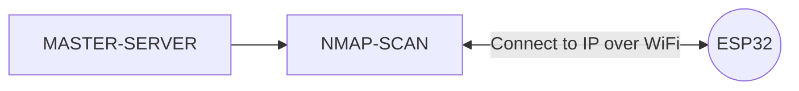
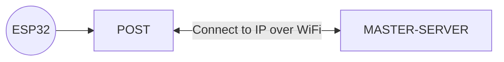

## Woolworths eInk MASTER-SERVER

The code in this directory is to be placed on a Windows or Linux Server running PHP (V7.4.7 tested). All eInk tags will then be able to be found once the server is running.

**Server Requirements:** Windows Server or Linux and PHP 7.4.7 (minimum).


## Data Flow Diagram
Saving to the ESP32

&nbsp;
Saving to the MASTER-SERVER

&nbsp;
Saving and Editing Database Entries
```mermaid
graph LR
A[MASTER-SERVER] --> MYSQL-INTERFACE -- Connect to Chosen Table IP over WiFi <--> B((ESP32))